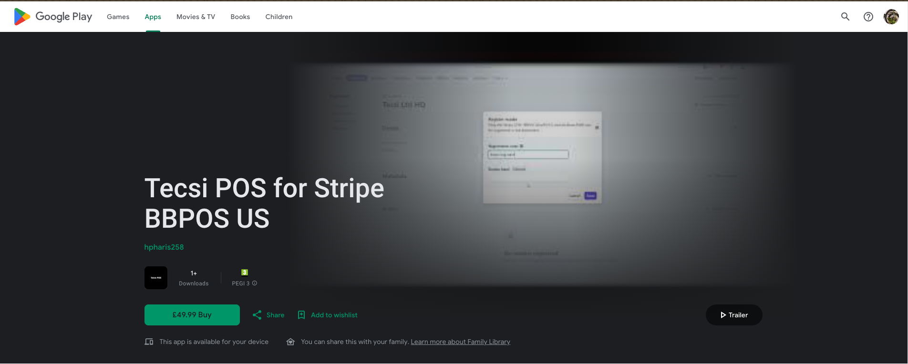
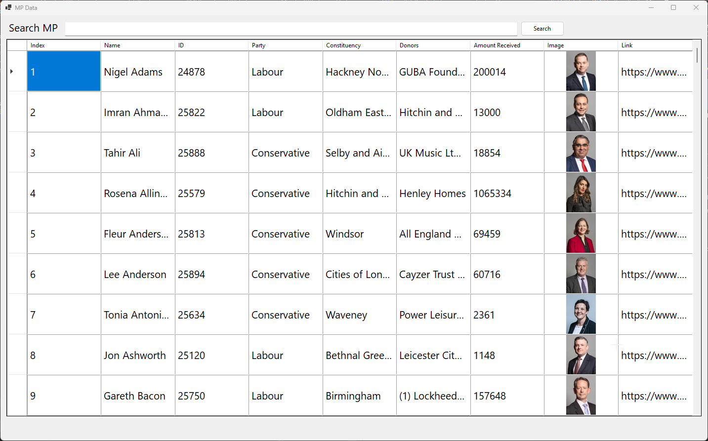

## Tecsi POS
A simple Point of Sale Application, allowing anyone to use their Stripe BBPOS WisePOS E terminal for a one time fee instead of per transaction charges, which can save thousands for clients that take more than 5000$ during the lifetime of their terminal use.
- 
- Tags: Tecsi POS
- Badges:
  - Stripe [blue]
  - React Native [blue]
  - Android [blue]
- Buttons:
  - Go to Project [https://play.google.com/store/apps/details?id=com.hpharis258.stripePOSUS1]

## Sutton University
A portal for Sutton University (Scenario provided as part of an assingment in College). Utilizing AWS Amplify to produce scalable solution that can meet increasing user demand. 
- 
- Tags: Sutton University
- Badges:
  - React [blue]
  - AWS AMPLIFY [blue]
  - Full Stack Web App [blue]
  - React [blue]
  - JavaScript [blue]
- Buttons:
  - Go to Project [https://github.com/hpharis258/SuttonUniversityPortal]

## Member of Parliament Data Parser
This project uses different data from www.theyworkforyou.com website, utilizing their API and other publicaly available data to bring users useful information about each Member of parliament. 
- 
- Tags: Category 3
- Badges:
  - C# [blue]
  - .NET [blue]
  - Windows Forms [blue]
  - XML API [blue]
  - Data Processing [blue]
- Buttons:
  - Go to Project [https://github.com/hpharis258/XMLWinFormsParser]