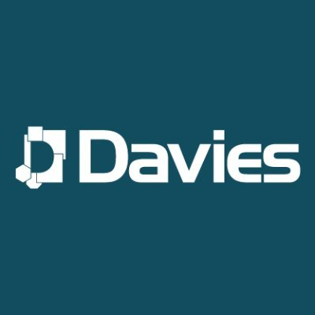

## Davies Group
- *Developer* | July'2023 - Still working here.
- 
- Tags: Davies Group
- Badges:
  - C# [blue]
  - Dart/Flutter [blue]
  - Azure [blue]
  - Postgres SQL [blue]
  - Supabase [blue]
  - Devops [blue]
  - Git/GitHub [blue]
  - Consulting [blue]
- List Items:
  - Full Stack Web application development - utilizing C#, Dart/Flutter, Supabase and Cosmos DB.
  - Low Code Development - Utilizing Low code builders to deliver software quickly.
  - Cloud Development - Utilizing Microsoft Azure to Deliver Cloud Based Solutions.
  - Application, Low Code and Cloud Consulting.

## Ascent Business
- *Cloud Systems Developer* | March'2022 - July'2023
- 
- Tags: Ascent Business
- Badges:
  - Node js [green] 
  - React, Dev Extreme [green]
  - CRM [green]
 - List Items: 
  - CRM Systems Devlopment.
  - API Integration and Plugin Development.
  - JavaScript Development, Node js, React, DevExtreme.
  - Financial Systems such as Stripe and Xero integrations.

## Certifications
- *My current certifications and additional qualifications.* | 
- 
- Tags: Certifications
- Badges:
  - Cybersecurity [purple] 
  - Azure [green]
  - C# [green]
 - List Items: 
  - Microsoft Certified: Azure AI FundamentalsMicrosoft Certified: Azure AI Fundamentals
  - Foundational C# Developer Certification with Microsoft.
  - Microsoft Certified: Dynamics 365 Fundamentals (CRM).
  - Microsoft Certified: Dynamics 365 Fundamentals (ERP).
  - Microsoft Certified: Azure Fundamentals.
  - Netcom Training Level 3 CSIS (Cyber Security Infrastructure Specialist).

## BMET
- *Cloud Computing - Software Development Student* | October'2021 - May'2023
- 
- Tags: BMET
- Badges:
  - Programming [red]
  - Data Structures and Algorithms [red]
  - Cloud Computing [red]
  - OOP [red]
- List Items: 
  - Completed Level 4 and 5, Cloud Computing (Software Development) Courses.
  - Achieved highest possible grades in Data Structures and Algorithms module.
  - Developed multiple projects using AWS. 
  - Developed a solid understanding of OOP.

## School-42-Wolfsburg
- *Student - Piscine Participant* | January 2020
- 
- Tags: School-42-Wolfsburg
- Badges:
  - Programming [red]
  - Linux [red]
  - C [red]
  - Bash Scripting [red]
- List Items: 
  - Completed a month of coding in C.
  - Re-wrote multiple different Linux commands in C.
  - Utilised UNIX Standard Library.
  - Started my self thought coder journey.